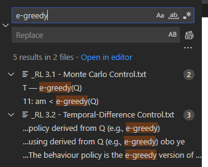

# PDF-OCR-TXT
for Ctrl-F searching through multiple PDF files 
- to be used with vscode's search interface to highlight keyword occurence in which PDf file (namely course slides). 

## Get Started
1. Install Tesseract:
    - https://github.com/tesseract-ocr/tesseract
    - on Windows: use UB Mannheim's installer at https://github.com/UB-Mannheim/tesseract/wiki
    - record your install directory and the exe path
        - e.g. `C:/blablabla/tesseract.exe`
        - make sure you can invoke it in arbitrary directory by `C:/blablabla/tesseract.exe some.pdf somename` and it will generate a sample.txt containing the OCR text results. 
2. Install dependencies: 
    - `pdf2image`
    - tested Python version: `3.12.7`
3. Modify `TESSERACT_PATH` in `ocr.py` to your exe path
4. Run `python ocr.py <your pdf path/dir>`
- e.g. `python ocr.py readme.pdf` produces `_readme.txt`
- it cleans up the intermediate directory
- `<pdf path>` can also be a directory, then all pdf within will be converted
- by default it skips existing `_pdfname.txt` files, but can enable overwrite by `--overwrite` flag. 

### Misc
- Yes pytesseract exists, wasn't able to get it working with PATH in win11
- Plan to work it into a ubuntu-based docker container and run it as a local service :P

